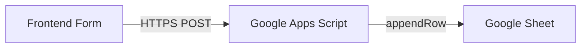

# Form → Google Sheets Integration Guide

This document outlines how to connect any web form (HTML or React) directly to a Google Sheet. This method works perfectly on static hosting providers like **GitHub Pages**.

## Reference Architecture



## 1. Google Apps Script Code
Create a new script at [script.google.com](https://script.google.com) and paste this:

```javascript
function doPost(e) {
  try {
    const sheet = SpreadsheetApp.getActiveSpreadsheet().getActiveSheet();
    const data = JSON.parse(e.postData.contents);
    
    // Column Mapping
    const row = [
      new Date(),           // Date
      data.name,           // Name
      data.email,          // Email
      data.phone || "",    // Phone
      data.serviceNeed,    // Service
      data.message || "",  // Message
      data.source || "web" // Source
    ];
    
    sheet.appendRow(row);
    
    return ContentService.createTextOutput(JSON.stringify({ status: "success" }))
      .setMimeType(ContentService.MimeType.JSON);
  } catch (err) {
    return ContentService.createTextOutput(JSON.stringify({ status: "error", message: err.toString() }))
      .setMimeType(ContentService.MimeType.JSON);
  }
}
```

## 2. Deploying the Script
1. Click **Deploy** → **New Deployment**.
2. Select **Web App**.
3. Set "Execute as" to **Me**.
4. Set "Who has access" to **Anyone**.
5. Copy the **Web App URL**.

## 3. React Frontend Implementation
When calling from a static site, you MUST use `mode: 'no-cors'`.

```javascript
const submitToSheets = async (formData) => {
  const SCRIPT_URL = 'PASTE_YOUR_URL_HERE';
  
  await fetch(SCRIPT_URL, {
    method: 'POST',
    mode: 'no-cors', // Critical for CORS bypass on static sites
    headers: { 'Content-Type': 'application/json' },
    body: JSON.stringify(formData),
  });
  
  // Return success state
  return true;
};
```

## 4. Why 'no-cors'?
Google Apps Script does not support standard CORS headers for JSON POSTs from different domains. By using `mode: 'no-cors'`, the browser sends an "opaque" request. You won't be able to read the response body in JavaScript, but the data will reach the script and be written to your sheet.
